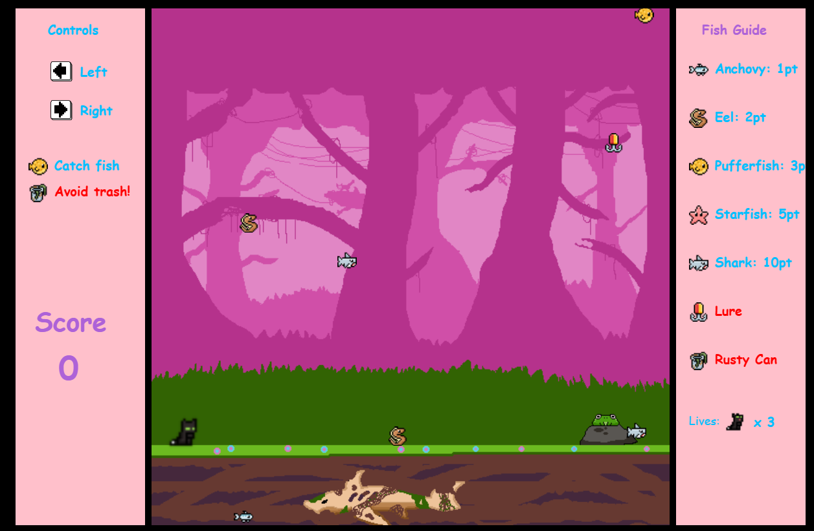

# 🐱 Cat Catcher

A cozy HTML5 canvas game made with JavaScript and pixel love.  
Catch fish, dodge trash, and enjoy lively animations — all packed into a single file for max shareability.

---

## 🎮 Overview

This game uses a multi-canvas layout:
- **Main canvas**: the game world with falling fish and an animated cat sprite
- **Right panel**: guide showing fish types, point values, and remaining lives
- **Left panel**: control hints, goal reminders, and live score display

---

## 🧰 Features

- Catchable fish with varying point values  
- Hazards (lures, rusty cans) that reduce lives  
- Score and lives tracker  
- Keyboard movement with idle + lick animations  
- Sprite animation system (lick, idle, run)  
- Dynamic UI panels rendered with canvas  
- Difficulty scaling — fish fall faster and spawn more frequently as you succeed  
- Game Over screen with a “Play Again” button

---

## 🎯 Controls

- `ArrowLeft` → Move left  
- `ArrowRight` → Move right  
- Release arrow keys → Cat randomly idles or licks

---

## 🗂️ Project Structure

- `index.html` – HTML file that sets up the canvas layout and links scripts  
- `main.js` – Core game logic, rendering, sprite animation, and UI  
- `style.css` – Flexbox layout and styling  
- `images/` – All sprite assets (fish, trash, UI, cat, etc.)

---

## 🔮 Possible Future Features

- Background music and sound effects  
- Start screen with instructions  
- More fish types and fun hazards  
- Score saving or local leaderboard

---

## 🚀 How to Run

1. Clone or download the repo  
2. Open `index.html` in your browser — no build tools needed

---

## 👨‍💻 Author

**Youssef Amin**  
> Built to sharpen my JavaScript and Canvas skills, and to make even fish feel loved.
